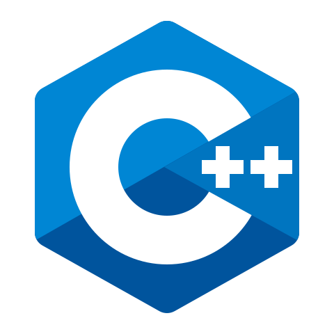
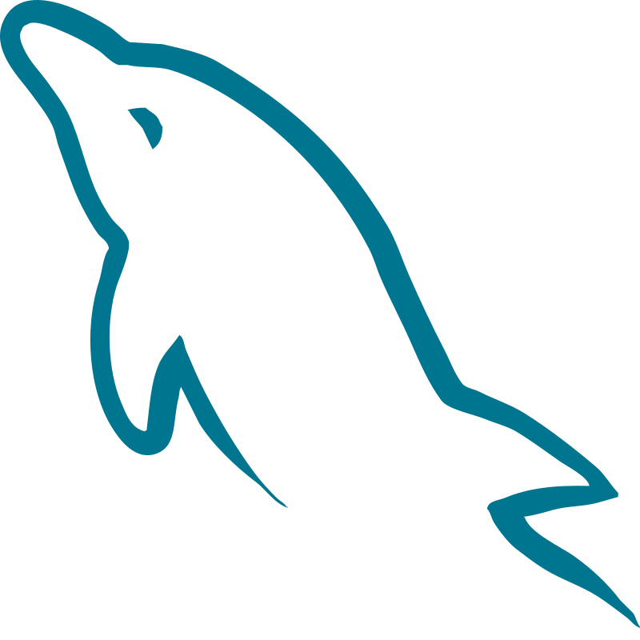

<!-- markdownlint-disable MD033 -->

  

<h1 align="center">Hi 👋, I'm Pranav Arun </h1>

I'm a passionate full-stack developer dedicated to building elegant web experiences and solving complex problems with modern tech. Welcome to my GitHub profile where I share my creative projects and explorations.

<h3> 👨🏻‍💻 About Me </h3>

- 🔭 &nbsp; I’m currently learning **MERN Stack**.
- 🤔 &nbsp; Exploring new technologies and building software solutions and quick hacks.
- 🎓 &nbsp; Studying **Computer Science and Business Systems**.
- 💼 &nbsp; **Front-end Web Developer** & **Back-end Web Developer**.
- 🌱 &nbsp; Enthusiast in **Cyber Security** and **Artificial Intelligence**.
- ✍️ &nbsp; Hobbies: Watching Anime and trying out the latest design trends.
- ☕ &nbsp; _I believe, a perfect cup of coffee can be the ultimate solution for any stress._
- 📫 &nbsp; Reach me at [pranavarun19@gmail.com](https://mail.google.com/mail/?view=cm&fs=1&to=pranavarun19@gmail.com) or [Instagram](https://www.instagram.com/toxicbishop_/) or [Discord](https://discordapp.com/users/701732138269016064)

---

<h3 align="center">🛠 Languages and Tools:</h3>

<strong>Languages</strong>

  
  
  
  
  
  
  
  
  
  
  
  
  

<strong>Frontend</strong>

  
  
  
  
  
  
  <picture>
    <source media="(prefers-color-scheme: dark)" srcset="./assets/Logos/Next.js-light.svg">
    
  </picture>
  
  <picture>
    <source media="(prefers-color-scheme: dark)" srcset="./assets/Logos/Three.js-light.svg">
    
  </picture>
  
  
  
  

<strong>Backend & Databases</strong>

  
  
  <picture>
    <source media="(prefers-color-scheme: dark)" srcset="./assets/Logos/Express-light.svg">
    
  </picture>
  
  
  
  
  
  
  
  

<strong>Tools & Others</strong>

  
  
  <picture>
    <source media="(prefers-color-scheme: dark)" srcset="./assets/Logos/github-light.svg">
    
  </picture>
  
  
  
  
  
  
  
  
  
  
  
  

---

<h3 align="center">🤝 Connect with me:</h3>

  
  
  
  
  
  
  

 

 

  <table border="0">
    <tr>
      <td align="center">
        <h3 align="center"> GitHub Stats 📊</h3>
        
      </td>
      <td align="center">
        <h3 align="center">Top Languages 🔝</h3>
        
      </td>
    </tr>
  </table>

 

<h3 align="center">👾 Contribution Graph 2026</h3>

  <picture>
    <source media="(prefers-color-scheme: dark)" srcset="https://raw.githubusercontent.com/toxicbishop/toxicbishop/output/pacman-contribution-graph-dark.svg">
    <source media="(prefers-color-scheme: light)" srcset="https://raw.githubusercontent.com/toxicbishop/toxicbishop/output/pacman-contribution-graph.svg">
    
  </picture>

