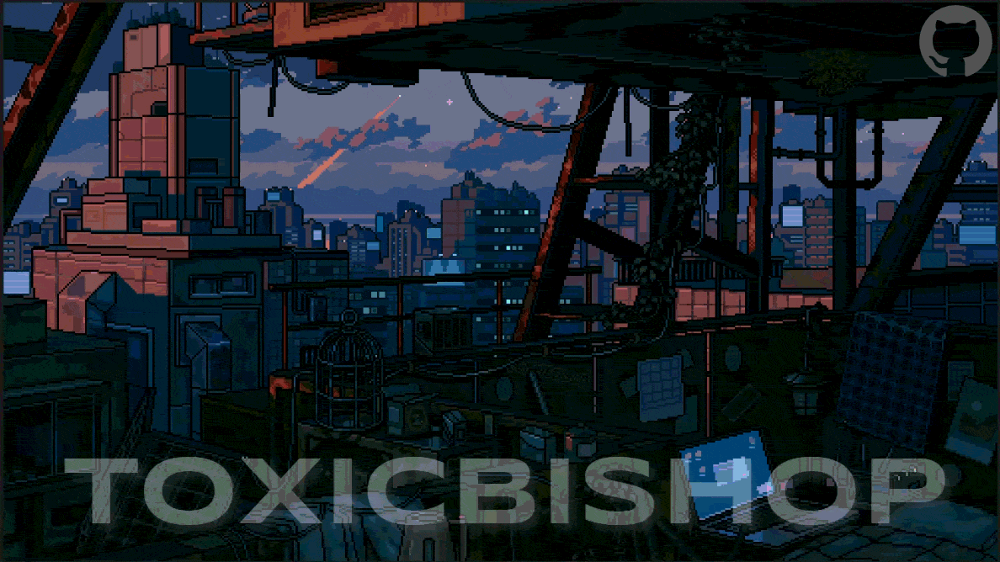

<!-- markdownlint-disable MD033 -->

  

 

 

A passionate backend developer & AI enthusiast dedicated to building robust systems and solving complex problems with modern tech. Welcome to my GitHub profile where I share my creative projects and explorations.

  &nbsp;
  &nbsp;
  &nbsp;
  &nbsp;
  

  

<h3>About Me 👨🏻‍💻</h3>

- 🔭 &nbsp; Currently working on **[Voting-System](https://github.com/Mohammed0572/VotingSystem)**
- 🌱 &nbsp; Currently learning **System Design** & exploring **LLM-powered apps**.
- 💬 &nbsp; Ask me about **React, Node.js, Python** — happy to help!
- 🤔 &nbsp; Exploring new technologies and building software solutions and quick hacks.
- 🎓 &nbsp; Studying **Computer Science and Business Systems**.
- 💼 &nbsp; **Backend Developer** & **AI/ML Enthusiast**.
- 🌱 &nbsp; Enthusiast in **Cyber Security**, **Artificial Intelligence**, **RAG apps** and **Machine Learning**.
- ✍️ &nbsp; Hobbies: Watching Anime and trying out the latest design trends.
- ☕ &nbsp; _I believe, a perfect cup of coffee can be the ultimate solution for any stress._

<h3 align="center">My Projects 🚀</h3>

<table>
  <tr>
    <td width="50%" valign="top">
      <h4>nano GPT 🤖</h4>
      
A CPU-friendly character-level GPT from scratch in PyTorch featuring modern architecture (RoPE, RMSNorm, GQA) and a modular RAG pipeline with Chroma DB.

      

        
        
        
      

      
    </td>
    <td width="50%" valign="top">
      <h4>DSA Study Hub 📚</h4>
      
An interactive educational web app to help students master Data Structures and Applications. Features modern UI with C source code viewer and browser-based algorithm simulations.

      

        
        
        
      

      &nbsp;
      
    </td>
  </tr>
  <tr>
    <td width="50%" valign="top">
      <h4>CryptVault 🔐</h4>
      
A hybrid C++ + x64 Assembly encryption tool with a blockchain-backed tamper-proof audit trail and P2P multi-user network. Built from scratch with zero external dependencies.

      

        
        
        
        
      

      
Contributors: <a href="https://github.com/supr1795">Supreeth</a> · <a href="https://github.com/Mohammed0572">Syed</a> · <a href="https://github.com/Rohithgaloth">Rohith</a>

      
    </td>
    <td width="50%" valign="top">
      <h4>Student Management System 🎓</h4>
      
A comprehensive Student Management System implemented in both Python and Java. Demonstrates the evolution of a GUI application from basic CRUD to advanced analytics in two different programming ecosystems.

      

        
        
        
      

      
    </td>
  </tr>
  <tr>
    <td width="50%" valign="top">
      <h4>VITAL Health App 💚</h4>
      
A streamlined health tracker built with Flutter and backed by Google Apps Script + Google Sheets. Ultra-lightweight and focused on simplicity.

      

        
        
        
      

      
    </td>
    <td width="50%" valign="top">
      <h4> Multimodal Blockchain based Voting System 🗳️</h4>
      
A tamper-proof election platform integrating biometric facial recognition with decentralized Ethereum ledgers.

      

        
        
        
        
      

      
    </td>
  </tr>
</table>

<h3 align="center">Languages and Tools 🛠:</h3>

<strong>Languages</strong> 
  

<strong>Frontend</strong> 
  

<strong>Backend & Databases</strong> 
  

<strong>AI / ML & Data Science</strong> 
   
   
  
  
  
  
  
  
  
  
  

<strong>Mobile</strong> 
  

<strong>Tools & DevOps</strong> 
   
   
  

<!-- GITLAB_REMOVE_START -->
<h3>⚡ Recent Activity</h3>

<!--START_SECTION:activity-->
1. ❌ Closed PR [#23](https://github.com/toxicbishop/Mac-Portfolio/pull/23) in [toxicbishop/Mac-Portfolio](https://github.com/toxicbishop/Mac-Portfolio)
2. ❌ Closed PR [#22](https://github.com/toxicbishop/Mac-Portfolio/pull/22) in [toxicbishop/Mac-Portfolio](https://github.com/toxicbishop/Mac-Portfolio)
3. ❌ Closed PR [#21](https://github.com/toxicbishop/Mac-Portfolio/pull/21) in [toxicbishop/Mac-Portfolio](https://github.com/toxicbishop/Mac-Portfolio)
4. ❌ Closed PR [#20](https://github.com/toxicbishop/Mac-Portfolio/pull/20) in [toxicbishop/Mac-Portfolio](https://github.com/toxicbishop/Mac-Portfolio)
5. 🎉 Merged PR [#24](https://github.com/toxicbishop/Mac-Portfolio/pull/24) in [toxicbishop/Mac-Portfolio](https://github.com/toxicbishop/Mac-Portfolio)
<!--END_SECTION:activity-->

  &nbsp;&nbsp;

<h3 align="center">Contribution Graph 👾</h3>

  <picture>
    <source media="(prefers-color-scheme: dark)" srcset="https://raw.githubusercontent.com/toxicbishop/toxicbishop/output/pacman-contribution-graph-dark.svg">
    <source media="(prefers-color-scheme: light)" srcset="https://raw.githubusercontent.com/toxicbishop/toxicbishop/output/pacman-contribution-graph.svg">
    
  </picture>

<!-- GITLAB_REMOVE_END -->
